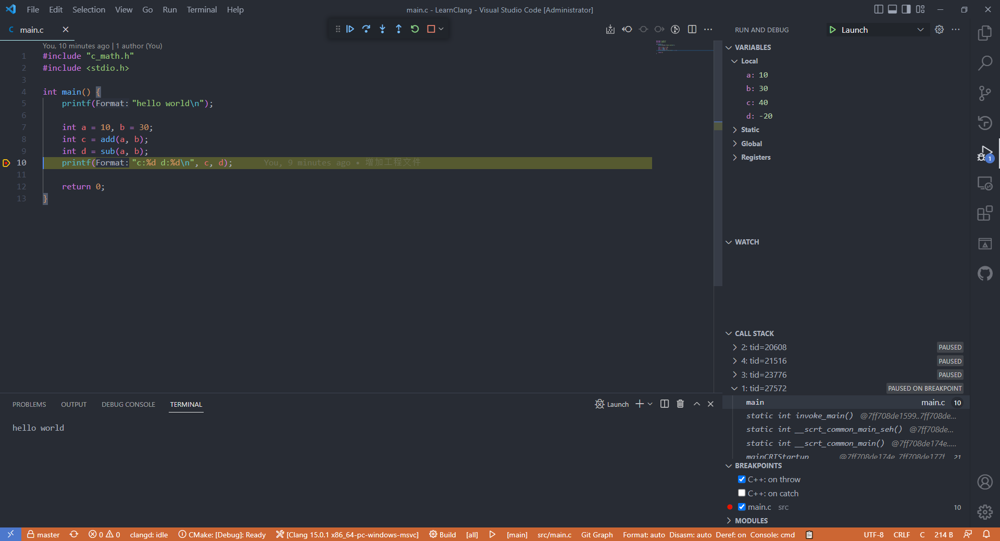

# Vscode_Clang_LLDB_CMake_Ninja_Clangd_MSVC

## 基本说明
本Demo用于搭建一个基于VSCode+Clang+LLDB+CMake+MSVC工具链的C/C++开发环境，具备智能提示、引用跳转、可视化调试等功能。

实际测试在Windows平台上选用该套工具链更加合适。

主要用到的工具如下：

* [VSCode编辑器](https://code.visualstudio.com/)
* [LLVM](https://releases.llvm.org/download.html)
* [CMake构建系统](https://cmake.org/)
* [Ninja构建系统](https://ninja-build.org/)
* [MSVC构建工具](https://visualstudio.microsoft.com/zh-hans/visual-cpp-build-tools/)
* [VSCode插件Clangd (提供智能提示、引用跳转等功能)](https://marketplace.visualstudio.com/items?itemName=llvm-vs-code-extensions.vscode-clangd)
* [VSCode插件CodeLLDB (提供调试功能)](https://marketplace.visualstudio.com/items?itemName=vadimcn.vscode-lldb)
* [VSCode插件CMake Tools](https://marketplace.visualstudio.com/items?itemName=ms-vscode.cmake-tools)
* [VSCode插件CMake Language Support](https://marketplace.visualstudio.com/items?itemName=josetr.cmake-language-support-vscode)

## Snapshot
